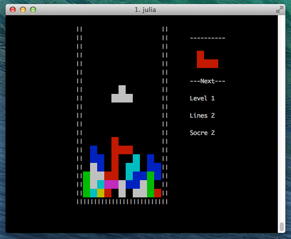

Termtris.jl
===========

A falling block game written in [Julia](http://julialang.org), that runs in your terminal window!



Controlled with arrows (left, right, up is rotate, down is drop).


## Install

`Termtris.jl` requires [TermWin.jl](https://github.com/tonyhffong/TermWin.jl) to be installed. Only tested on OSX in iTerm2, no guarantees anything works anywhere else.

```julia
Pkg.add("TermWin")
Pkg.clone("https://github.com/IainNZ/Termtris.jl.git")
```

## Credits

* Based on [Lua Termtris](https://github.com/tylerneylon/termtris) by [Tyler Neylon](https://github.com/tylerneylon).

* `Termtris.jl` by [Iain Dunning](https://github.com/IainNZ).

* License not yet clarified.